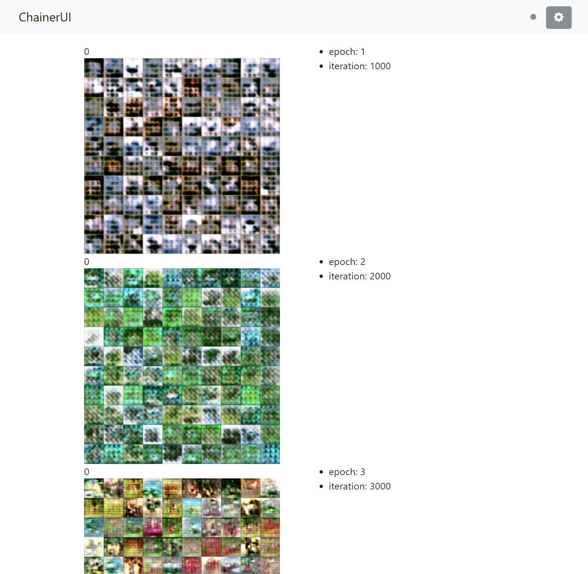

# DCGAN with ChainerUI

original code: [chainer/example/dcgan](https://github.com/chainer/chainer/tree/master/examples/dcgan)

```bash
$ chainerui project create -d results -n dcgan
```

```bash
$ python train_dcgan.py -o results/demo -g 0
```

## Usage

from `viualize.py`:

```py
from chainerui import summary

def out_generated_image(gen, dis, rows, cols, seed):
    def make_image(trainer):
        np.random.seed(seed)
        n_images = rows * cols
        xp = gen.xp
        z = Variable(xp.asarray(gen.make_hidden(n_images)))
        with chainer.using_config('train', False):
            x = gen(z)
        x = chainer.cuda.to_cpu(x.data)
        # [chainerui] cache the target array
        summary.image(x, row=rows)
        np.random.seed()
    return make_image
```

from `train_dcgan.py`

```py
from chainerui.extensions import ImageReport

def main():
    # ...(snip)
    # [chainerui] add extension with visualizer
    #             collect latest image from cache area
    visualizer = out_generated_image(gen, dis, 10, 10, args.seed)
    trainer.extend(ImageReport(trigger=snapshot_interval, image_generator=visualizer))
    # ...(snip)
```

on ChainerUI:


