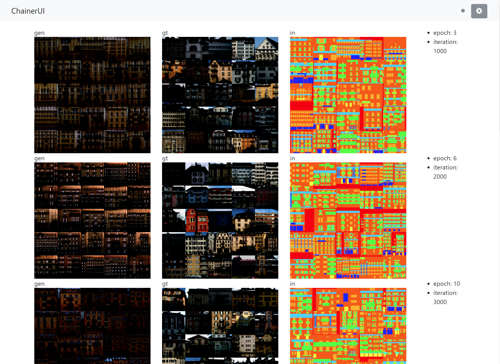
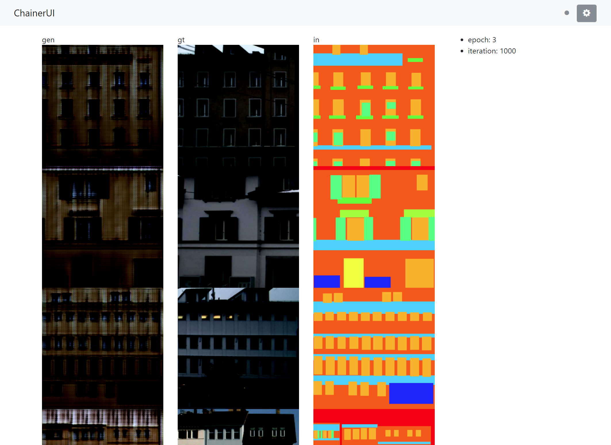

# pix2pix with ChainerUI

original source: [chainer-pix2pix](https://github.com/pfnet-research/chainer-pix2pix)

```bash
$ chainerui project create -d results -n pix2pix
```

```bash
$ python train_facade.py -i /home/dataset/facade/base -o results -g 0
```

## Usage

from `facade_visualizer.py`:

```py
from chainerui import summary

def out_image(updater, enc, dec, n_images, rows, seed):
    def make_image(trainer):
        # ...(snip)
        # [chainerui] cache the target array, each named with 'gen', 'in', 'gt'
        summary.image(gen_al, name='gen', row=rows)
        summary.image(x, name='in', row=rows, mode='HSV')
        summary.image(gt_all, name='gt', row=rows)

    return make_image
```

from `train_facade.py`:

```py
from chainerui.extensions import ImageReport

def main():
    # ...(snip)
    # [chainerui] add extension with visualizer
    #             collect latest image from cache area
    visualizer = out_image(updater, enc, dec, args.visualize_batchsize,
                           args.rows, args.seed)
    trainer.extend(ImageReport(trigger=snapshot_interval, image_generator=visualizer))
    # ...(snip)
```

on ChainerUI:



set `--rows 0`


