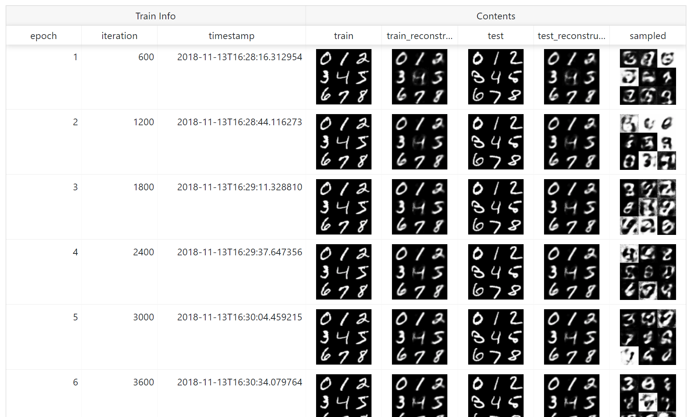

# VAE (MNIST) with ChainerUI

original code: [chainerui/examples](https://github.com/chainer/chainerui/tree/master/examples)

```bash
$ chainerui project create -d results -n vae-mnist
```

**Please use [support grayscale branch](https://github.com/disktnk/chainerui/tree/fix/image-api-gray)**, this patch will be merged.

```bash
$ python train_vae.py -o results/demo -g 0
```

## Usage

from `train_vae.py`:

```py
from chainerui import summary

def main()
    # ...(snip)
    # [chainerui] add extension with visualizer
    #             collect latest image from cache area
    def visualize(trainer):
        train_ind = [1, 3, 5, 10, 2, 0, 13, 15, 17]
        x = chainer.Variable(np.asarray(train[train_ind]))
        with chainer.using_config('train', False), chainer.no_backprop_mode():
            x1 = model(x)
        def convert(x):
            return x.reshape(9, 28, 28).transpose(0, 2, 1)
        summary.image(convert(x), name='train', row=3)
        summary.image(convert(x1), name='train_reconstructed', row=3)

        test_ind = [3, 2, 1, 18, 4, 8, 11, 17, 61]
        x = chainer.Variable(np.asarray(test[test_ind]))
        with chainer.using_config('train', False), chainer.no_backprop_mode():
            x1 = model(x)
        summary.image(convert(x), name='test', row=3)
        summary.image(convert(x1), name='test_reconstructed', row=3)

        # draw images from randomly sampled z
        z = chainer.Variable(
            np.random.normal(0, 1, (9, args.dimz)).astype(np.float32))
        x = model.decode(z)
        summary.image(convert(x), name='sampled', row=3)

    trainer.extend(ImageReport(image_generator=visualize))
```

on ChainerUI:


